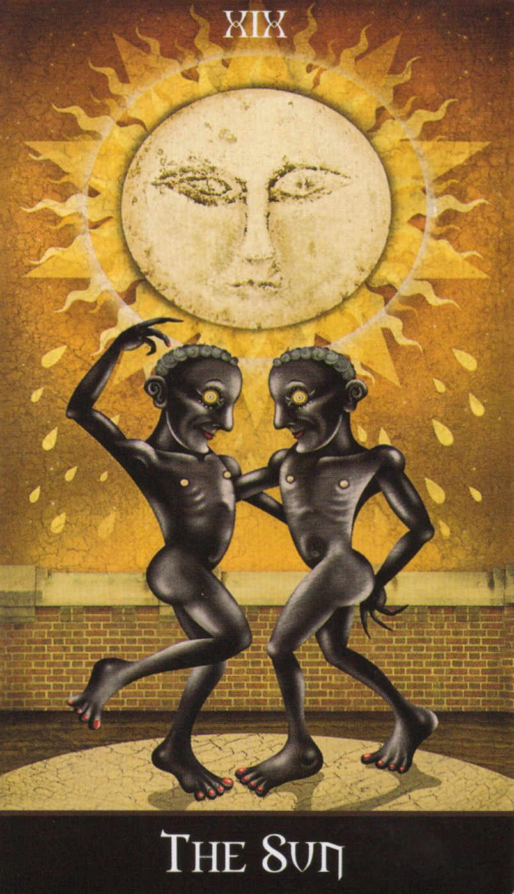
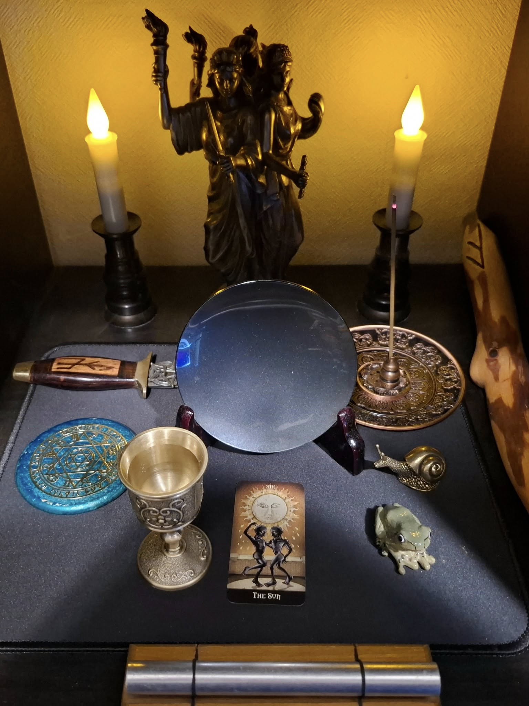

# ☀️ Ravensgate Midsummer Rite（夏至の祝祭儀式）

この儀式は、夏至（Midsummer）における太陽の絶頂と、そこから始まる陰の季節への転換点を祝うものです。  
栄光と成熟、そして自己の光を見出すためのソロ祝祭として構成しています。

---

## 🔸準備物

- ローブ（白または金系／位階に応じて調整可）  
- 魔法円（フラフープ円＋LEDキャンドル）  
- The Sunカード（Deviant Moon Tarot 推奨）  
- 土と灰（小皿に）  
- ワンド（木製または金属製）  
- 水の杯  
- ワインとビスケット（または果汁＋軽食）  
- 鏡（自分の顔が映るもの／卓上鏡で可）  
- ベル  

---

### Tarot

---

## 🔹Ritual Text（儀式文）

### (English)

[Ring bell 3 times. Step into the circle.]

In the name of the Sun at its zenith,
I open this circle on the Midsummer's day.

I call upon glory, completion, and the light within.
I place the Sun card at the center of my work.

[Draw the pentagram to open the circle. Start from top to lower left.]

[Touch the earth, sprinkle the ash]
From soil and ash, the cycle reaches its height.

[Dip the wand into the cup of water]
May clarity and strength rise within me.

[Look into the mirror]
May I see the true light of my being.

[Raise the cup and food]
May I receive the fullness of life, and reflect it outward.

[Drink the wine, eat the biscuit]

I shine with the fire of the sun.
I honor the turning of light toward shadow.

[Draw the pentagram to close the circle. Start from lower left to top.]

So may it be.

---

### （日本語訳）

［ベルを3回鳴らし、円に入る］

太陽が頂点にあるこの時において、
私は夏至の祝祭にこの円を開く

栄光と完成、そして内なる光をここに呼び出す。
太陽のカードを、私の作業の中心に置く

［五芒星を描いて円を開く。頂点から左下へ開始］

［土に触れ、灰を撒く］
土と灰より、巡りは頂点に至る

［ワンドを水の杯に浸す］
明晰さと力が、私の内に昇りますように

［鏡を見つめる］
私の本来の輝きを、いまここに見る

［杯と食物を掲げる］
私は命の満ちるものを受けとり、それを世に返す

［ワインを飲み、ビスケットを口にする］

私は太陽の火とともに輝き、
光が影へと移りゆく転換を讃える

［五芒星を描いて円を閉じる。左下から頂点へ開始］

そうありますように

---

### 使用例：Deviant Moon Tarot  

---

© 2025 Ravensgate-Tux. この文書は [CC BY-SA 4.0](https://creativecommons.org/licenses/by-sa/4.0/deed.ja) に基づき公開されています。
